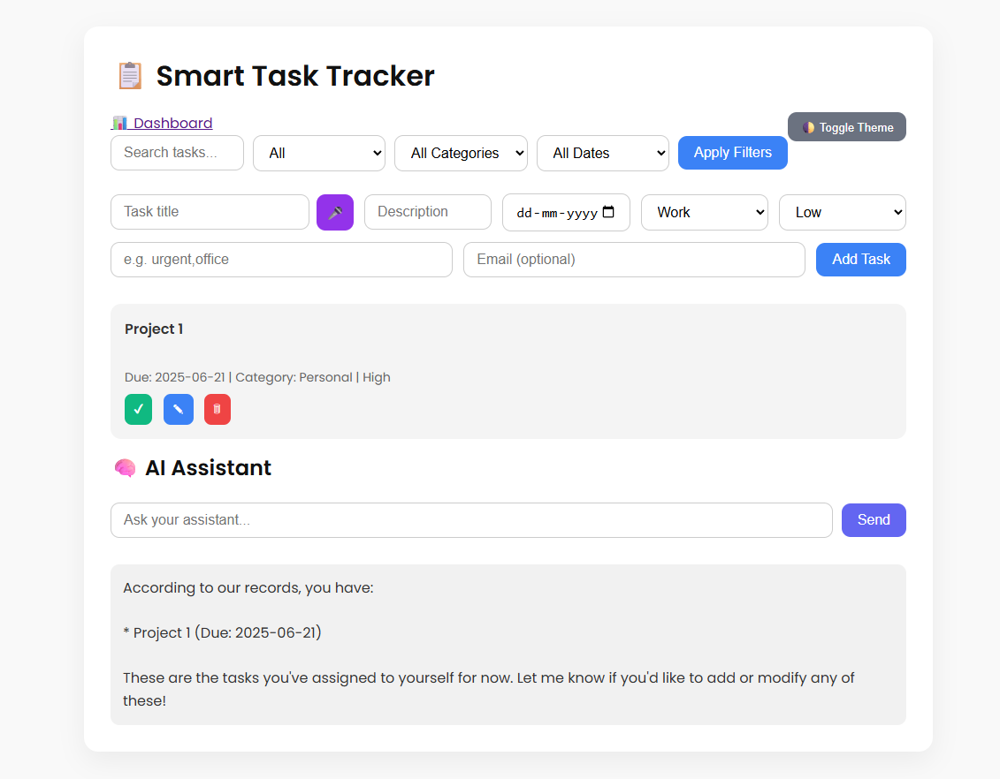
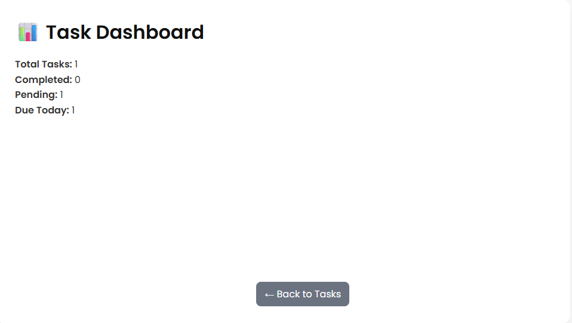
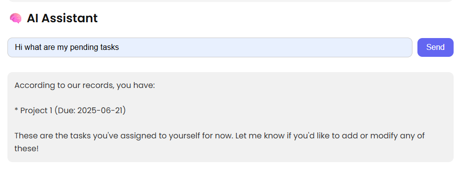

# 📋 Smart Task Tracker

A full-stack intelligent task management app built with **Flask**, **SQLite**, and **HTML/CSS/JS**, featuring:
- 🔔 Email reminders
- 🎤 Voice input
- 🧠 AI-powered task assistant (Ollama + LLaMA 3)
- 📊 Dynamic dashboard
- 🌙 Theme toggle

---

## 🚀 Features

- ✅ Add, edit, delete, complete tasks
- 📅 Filter tasks by status, category, and due date
- 📬 Optional email reminders for tasks due today
- 🎤 Voice input for task title (Speech-to-text)
- 🧠 Ask AI questions about your tasks (context-aware)
- 📈 Dashboard for stats: total, completed, pending, due today
- 🌓 Dark mode with persistent preference

---

## 📸 Screenshots

### 🏠 Homepage


### 📊 Dashboard


### 🤖 AI Assistant Chat


### EMail Alert


---

## 🛠️ Tech Stack

- **Backend**: Python, Flask, SQLite
- **Frontend**: HTML, CSS (custom + Google Fonts), JavaScript
- **AI**: Ollama with LLaMA 3 (via OpenAI-compatible API)
- **Email**: Gmail SMTP + `smtplib`
- **Scheduling**: APScheduler

---

## 📦 Setup Instructions

 **Clone the repo**
   ```bash
   git clone https://github.com/yourusername/task-tracker.git
   cd task-tracker

